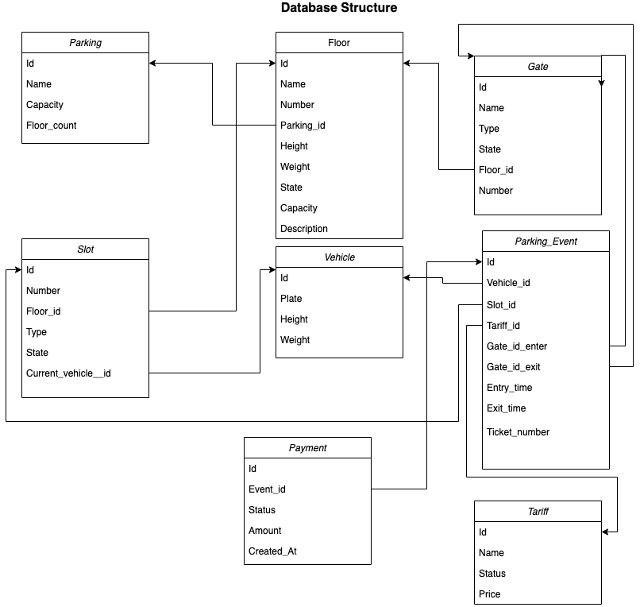

<h1 align="center">Parking Lot Management System  </h1> <br>  

<p align="center">  
  Api for parking lot management. 
</p> 

## Table of Contents  

- [Introduction](#introduction)
- [Initial Requirements](#Requirements)
- [Database structure](#Database)
- [How to build and run](#RunInstruction)
- [API](#api) 
- [Improvements](#Improvements)


## Introduction  
  
Problem statement : A backend system with API to handle autonomous parking lot should be designed and implemented.
Initial description : Any client car, when arrives at the parking building, gets automatically scanned and its weight 
and height data is sent to the system as the car approaches the gate. The parking has N floors, 
where each floor may have a different ceiling height and a different total weight capacity. The system must assign the 
approaching car to the best suitable spot and calculate the resulting price per minute. The payment, car transportation, 
and the rest are handled by other components, and it can be simply emulate them to build a business flow.

## Requirements
1. System must handle N-level parking type.
2. Each floor must have <br/>
        - maximum weight <br/>
        - maximum weight
3. Every car is scanned and weight and height parameters are defined. 
4. Free spot must be found and presented to car on entry.
5. Price per minute according to parameters must be presented.
6. Spot must be freed on vehicle exit event.
7. System must be extendible.


#Database


## How to build and run
## How to build

```shell script
$ ./gradlew build
```

## How to run locally

```shell script
$  java -jar build/libs/api-parking-lot.jar 
```

## API 

# Contracts

For see api documentation you can run 
> java -jar build/libs/api-parking-lot.jar 

and go to http://localhost:8080/swagger-ui.html

## Improvements
1. Concurrency can be applied to slot selection if there are more than one entries
2. Validations with statuses can be added to avoid data inconsistency
3. Slot selection algorithm can be improved according to new criterias forex. suggesting larger spot if suitable does not exist.
4. Test cases on service and helpers can be improved to cover all cases.